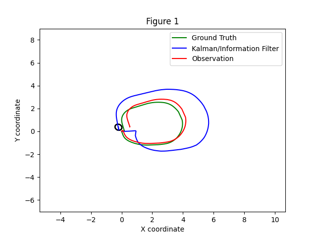
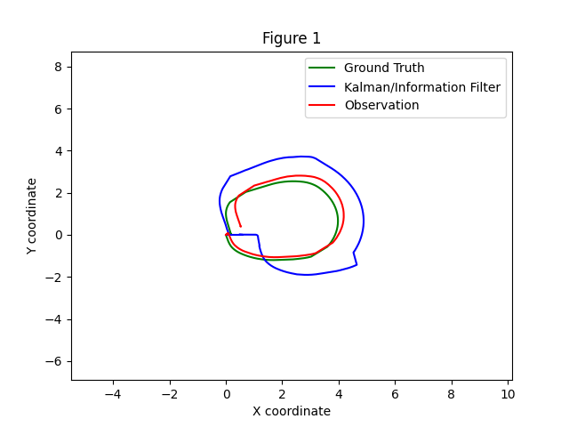
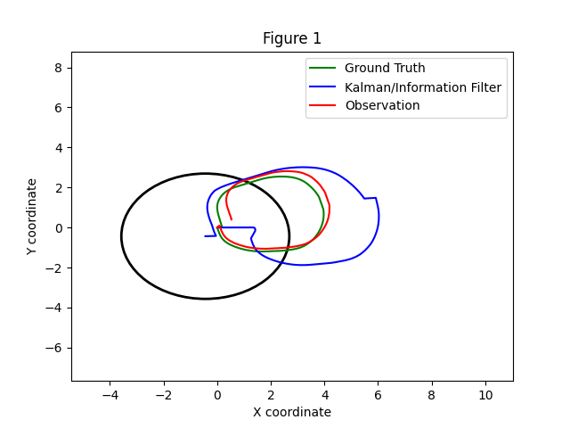
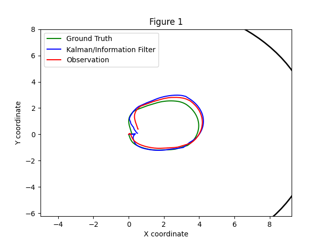

# Práctica 3: Filtro de Kalman Extendido (EKF)

## Parámetros para cada configuración

Los parámetros que se han modificado han sido `proc_noise_std` y `obs_noise_std` en los modelos 3d (*p3_ekf_adr/ekf_3d_state_estimation.py*), 7d (*p3_ekf_adr/ekf_7d_state_estimation.py*) y 8d (*p3_ekf_adr/ekf_8d_state_estimation.py*). El enunciado pide 3 configuraciones distintas:
1. Ruidos balanceados en el modelo y las observaciones
2. Ruido alto en las observaciones y moderado en el modelo
3. Ruido alto en el modelo y moderado en las observaciones

En cada modelo, siguiendo el orden de las configuraciones anteriormente descrita, se configura de la siguiente manera:
1. Modelo 3D:
   - `proc_noise_std = [0.002, 0.002, 0.001]` y `obs_noise_std = [1.02, 1.02, 100.01]`
   - `proc_noise_std = [0.002, 0.002, 0.001]` y `obs_noise_std = [10.0, 10.0, 1000.0]`
   - `proc_noise_std = [0.2, 0.2, 0.1]` y `obs_noise_std = [1.02, 1.02, 100.01]`
2. Modelo 7D:
   - `proc_noise_std = [0.1, 0.1, 0.05, 0.1, 0.1, 0.1, 0.1]` y `obs_noise_std  = [100.0, 100.0, 1000.0, 6.853891945200942e-06, 1.0966227112321507e-06, 0.0015387262937311438, 0.0015387262937311438]`
   - `proc_noise_std = [0.1, 0.1, 0.05, 0.1, 0.1, 0.1, 0.1]` y `obs_noise_std  = [1000.0, 1000.0, 10000.0, 6.853891945200942e-05, 1.0966227112321507e-05, 0.15, 0.15]`
   - `proc_noise_std = [1.0, 1.0, 0.5, 1.0, 1.0, 1.0, 1.0]` y `obs_noise_std  = [100.0, 100.0, 1000.0, 6.853891945200942e-06, 1.0966227112321507e-06, 0.0015387262937311438, 0.0015387262937311438]`
3. Modelo 8D:
   - `proc_noise_std = [0.1, 0.1, 0.05, 0.1, 0.1, 0.1, 0.1, 0.1]` y `obs_noise_std  = [100.0, 100.0, 1000.0, 6.85e-06, 1.10e-06, 0.00153, 0.00153]`
   - `proc_noise_std = [0.1, 0.1, 0.05, 0.1, 0.1, 0.1, 0.1, 0.1]` y `obs_noise_std  = [1000.0, 1000.0, 10000.0, 6.85e-05, 1.10e-05, 0.15, 0.15]`
   - `proc_noise_std = [1.0, 1.0, 0.5, 1.0, 1.0, 1.0, 1.0, 1.0]` y `obs_noise_std  = [100.0, 100.0, 1000.0, 6.85e-06, 1.10e-06, 0.00153, 0.00153]`

## Resultados de las configuraciones de los modelos

Para todas las configuraciones se usó el path circular que proporcionó la docencia en los bags, donde, de izquierda a derecha, las configuraciones serán las balanceadas, las que tienen ruido alto en las observaciones y, por último, las que tienen ruido alto en el modelo.

### Modelo 3D

  
  
  

Observando las gráficas, se puede apreciar que en el caso balanceado la estimación es bastante mala, esto puede deberse a que la estimación del filtro no se ajusta al ground truth. En el caso de ruido alto en las observaciones ocurre igual que en el caso balanceado, la estimaciçon es igual de mala, ya que no se tiene corrección a penas en la actualización porque la incertidumbre de los sensores es muy alta. En el caso de ruido alto en el modelo, la estimación ha mejorado considerablemente ajustandose al ground truth, esto puede deberse a que el ruido del modelo de movimiento es muy bajo y esto hacía que no se tuviese en cuenta la actualización de la estimación.

### Modelo 7D

  
  
  

Observando nuevamente las gráficas, se puede apreciar que en el caso balanceado la estimación se acerca un poco al ground truth por lo que no es un filtro tan malo. En el caso de ruido alto en las observaciones, se consigue observar que la estimación es peor que en el caso balanceado, ya que hay una incertidumbre alta en la medición de los sensores. Por último, en el caso de ruido alto en el modelo, se puede apreciar que la estimación es mucho mejor que en los casos anteriores, por ello, se puede decir que el filtro funciona correctamente.

### Modelo 8D

  
  
  

Observando por último las gráficas, se puede apreciar que en el caso balanceado y el caso de ruido alto en la observación, las estimaciones son muy malas debido a las mismas conclusiones obtenidas en los modelos  anteriores. Por último, en el caso de ruido alto en el modelo, la estimación ha mejorado considerablemente donde se puede concluir que se obtuvo un resultado fiable.
